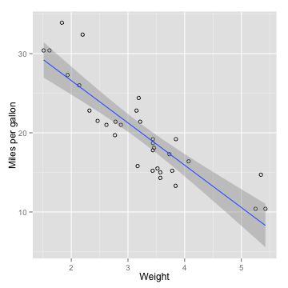

## About the product

This product allows for you to visually inspect the data from the standard R package 'mtcars' dataset

--- .class #id
## Using the product
The RShiny application allows you to chose which attribute of the dataset you would like to predict on.  It also allows for a number to be input which will produce a 'miles per gallon' predication for the entered predictor.

--- .class #id

## Linear regression using ggplot2
The following R code is used in the application to generate a scatterplot with regression line.


```r
ggplot(df, aes(x=predictor, y=mpg)) + geom_point(shape=1) + 
geom_smooth(method=lm) + xlab("Weight") + ylab("Miles per gallon")
```

 

--- .class #id

## Prediction using linear regression
The following code snippet will make a prediction on miles per gallon based on an input


```r
value_to_predict_num <- 5
df <- data.frame(mtcars["wt"], mpg=mtcars$mpg)
colnames(df)[1]<-"predictor"
linear_model <- lm(mpg~predictor, data=df)
res <- predict(linear_model, data.frame(predictor=value_to_predict_num))
rounded_result <- round(res[[1]], digits = 2)
      
paste("Prediction: Weight of", value_to_predict_num, 
      "will result in",toString(rounded_result), "miles per gallon")
```

```
## [1] "Prediction: Weight of 5 will result in 10.56 miles per gallon"
```
